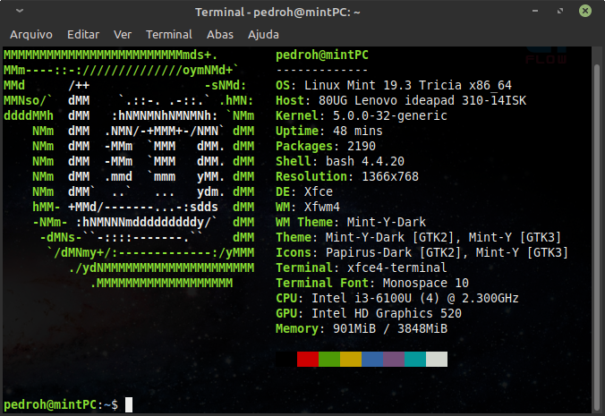

# Compilação do firmware MicroPython em Linux

Em todos os firmwares modifiquei o código-fonte apenas para modificar o nome do dispositivo e adicionar PHMPy para deixar registrado que o firmware foi compilado por mim. Não possui nenhuma outra modificação.

## Configurações do sistema operacional

- Utilizei o sistema operacional [Linux Mint 19.3 Tricia XFCE (64 bits)](https://linuxmint.com/edition.php?id=278) para compilar os firmwares MicroPython. Mais detalhes do sistema estão disponíveis na imagem abaixo.

- Para conseguir compilar precisei instalar todas as dependências utilizando o comando abaixo:

  `$ sudo apt-get install build-essential libreadline-dev libffi-dev git pkg-config`

- Utilizei o [gcc-arm versão 9.3.1](https://developer.arm.com/tools-and-software/open-source-software/developer-tools/gnu-toolchain/gnu-rm/downloads) ([gcc-arm-none-eabi-9-2020-q2-update-x86_64-linux.tar.bz2](https://developer.arm.com/-/media/Files/downloads/gnu-rm/9-2020q2/gcc-arm-none-eabi-9-2020-q2-update-x86_64-linux.tar.bz2?revision=05382cca-1721-44e1-ae19-1e7c3dc96118&la=en&hash=D7C9D18FCA2DD9F894FD9F3C3DC9228498FA281A)).
